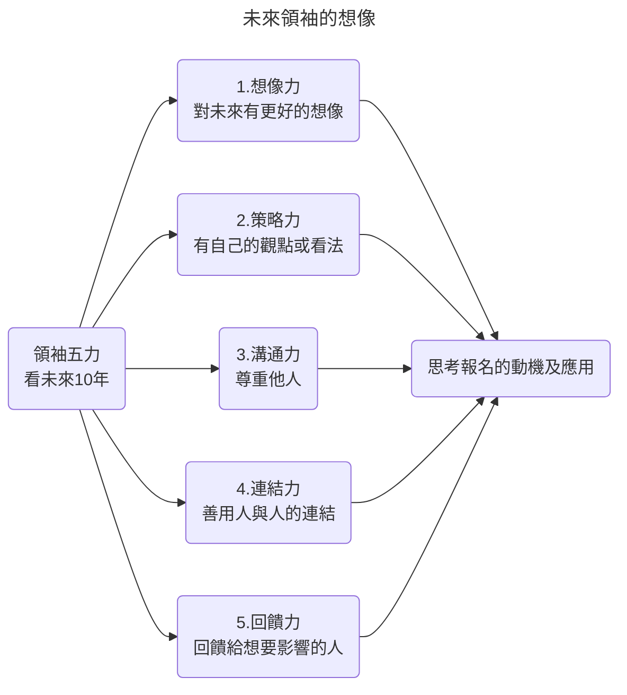
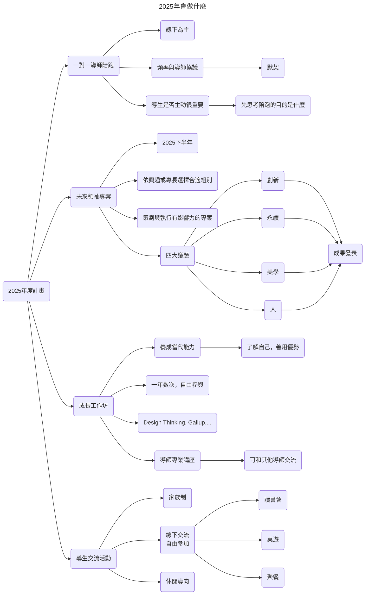

# 領袖100第6屆招生說明會

### 暖場
|講者|
|--|
|Jerry (招生組幹部)|

- 講座宣傳
- 2024/10/26 職場領導力大師開講 (https://career99.com.tw/)

---
### 主題1
|講者|
|--|
|Judy 石恬華 (領袖100創辦人)|

#### 創立宗旨與組織簡介
- 2019年成立的非營利組織
- 導師自發性傳承
- 契機：台灣沒有足夠多元，能跨世代與交流的平台
- 鎖定30世代族群
  - 工作10年左右，會發現有些地方需要突破
    - 轉換跑道
    - 升任管理職
    - 創業之路
- 每年有50位導師
  - 跨產業 (該產業的領域權威)
  - 跨身分 (企業家，二代接班人，高階經理人......)
  - 性別平衡
  - 都還在職 (不會有時代隔閡)
  - 導師與導生之間為相互交流的關係
    - 一對一陪跑一年
- 對導生的期待
  - 有期待
  - 有想像
  - 有目標
  - 希望能有突破 (在職場上發光發熱)
  - 正處在職涯關鍵時刻
    - 清楚知道未來的大方向
    - 有具體問題想要被解決
  - 學習態度
    - 願意不斷吸收和學習
    - 樂於和他人分享
- 透過新人加入，持續成長茁壯

#### 未來領袖的想像

---
### 主題2
|講者|
|--|
|Amy 施淑芳 (領袖100執行長，奧美集團策略長)|

#### 職涯貴人引路計畫
- 成長過程中，職涯出現很多貴人，才讓我們走到這裡
- 如果我們能成為他人的貴人，是很好的回饋機會
- 如果你希望能和職場以外的人有所互動，這是一個好機會

#### 談談領袖100
- 章法，多元，單純，無私
- 有些人可能會擔憂，自己比較內向，不擅長參與組織
  - 這裡可以獲得舒服的體驗
  - 沒有繁文縟節

#### 我們在2025年會做什麼

---
### 2024計畫時程
|講者|
|--|
|Jerry (招生組幹部)|

||時間|備註|
|--|--|--|
|報名|至2024/10/06止||
|面試|2024/11/16|**不能缺席**|
|開業式|2024/12/14|**不能缺席**|

---
### 中場Q&A
- 誰適合參加領袖100?
  - 希望有5年以上的工作經驗
  - 希望能進一步成長和歷練
  - 期待突破自我，加速實現目標
- 如何配對導師?
  - 導師們透過書審和面試紀錄，共同討論
- 未來一年的投入和獲得?
  - 一對一導師陪跑
    - 深度探索
    - 價值觀期待
    - 職涯規劃
- 不是北部的導生該怎麼辦?
  - 也能報名，但面試(11/16)和開業式(12/14)不能缺席

---
### 導生分享 Part1
|講者|
|--|
|Cindy (好奇學院創辦人)|

- 發展背景
  - 大學畢業後，擔任老師
  - 師大教育碩士，英國留學
  - 進入美商顧問業
  - 加入領袖100約4-5個月後，轉換跑道
- 導師指引
  - 如果你做不擅長或不喜歡的事，是不可能出色的，不出色就很難加薪
  - 導師協助挖掘資源
  - 工作的本質是利用自己的長處，彌補他人的短處，賺取中間的價差
    - 先找出自己的優勢

---
### 導生分享 Part2
|講者|
|--|
|Kyra (運輸倉儲/整合行銷)|

- 發展背景
  - 在品牌端從行銷傳播出發，搭配數位浪潮，結合消費者的數位軌跡，形成數據生態圈
  - 遇到升職，團隊管理的瓶頸
- 導師指引
  - 2週見面1次
  - 分享近況和生活動態
  - 教練形式
    - 將問題拆解，搭配Gallup優勢，引導找出解法
    - 遇到撞牆期或情境靈魂拷問時，導師會分享實戰經驗或他人案例，也提醒解法不一定適用每個人
    - 思考課題情境，運用自己的資源，找出方法應對
    - 討論過程中，是否看見自身的優勢天賦
- 領袖100家族活動
  - 輪流發起聚餐邀約
  - 擔任龍舟隊舵手
    - 反思組織優化方向

---
### 導生分享 Part3
|講者|
|--|
|Michael (錸放科技執行長&共同創辦人)|

- 發展背景
  - 2年前離開外商，自行創業
  - 透過社群媒體認識領袖100
  - 遇到創業問題，透過導師和導生彼此分享
- 導師指引
  - 每月1-2小時
  - 企業面臨的痛點
- 加入領袖100
  - 透過活動認識許多人
  - 拓展人脈
  - 報名時，先想想自己要什麼

---
### 終場Q&A
- 我今年已42歲，近期打算2次創業，請問是否符合資格?
  - 符合
  - 我們沒有明確定義幾歲不行，太不DEI了
- 可以一對多位導師嗎? 希望有機會和多位導師交流
  - 不行
  - 即使一對一，能和導師互動的機會也不多
  - 如果一對多，時間壓力會很大
  - 我們有講座和Workshop，還是有機會和其他導師交流
- 如何媒合導師和導生? 媒合邏輯是什麼?
  - 還是依導生的需求為起點
  - 我們會透過面試來理解，導生報名的需求是什麼
  - 以前有導生會覺得，怎麼會媒合到這位導師，後面會發現配的很好
  - 了解需求 -> 洞察 -> 配對導師
- 面試或開業式會在當天的什麼時候?
  - 面試會分上下半場，如果有確定不能出席的時段，先讓我們知道
  - 開業式的早上和下午都需出席
- 如果我剛離職，可以報名嗎?
  - 可以的
  - 我們沒有要求一定要就業中才能報名
  - 說不定下一份工作有想法，所以待業中也歡迎

---
### 領袖100聯絡方式
||聯絡方式|
|--|--|
|官方網站|https://leaders100.world/|
|Instagram|https://www.instagram.com/leaders100.world/|
|Linkedin|https://www.linkedin.com/company/leaders100|

---
### 會議時間軸
|時間|主題|講者|
|--|--|--|
|00:43|講座宣傳|Jerry (招生組幹部)|
|02:32|創立宗旨與組織簡介 未來領袖的想像|Judy 石恬華 (領袖100創辦人)|
|15:35|職涯貴人引路計畫 談談領袖100 我們在2025年會做什麼|Amy 施淑芳 (領袖100執行長，奧美集團策略長)|
|27:18|2024計畫時程|Jerry (招生組幹部)|
|29:12|中場Q&A||
|33:25|導生分享 Part1|Cindy (好奇學院創辦人)|
|37:52|導生分享 Part2|Kyra (運輸倉儲/整合行銷)|
|43:20|導生分享 Part3|Michael (錸放科技執行長&共同創辦人)|
|48:00|終場Q&A|Amy Jerry|
|53:00|領袖100聯絡方式|Shannon (活動主持人)|
